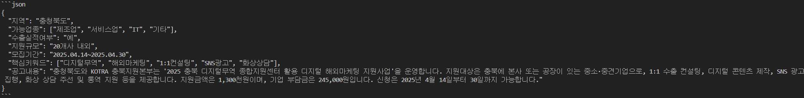
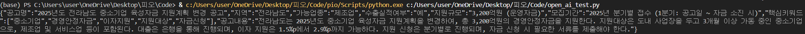
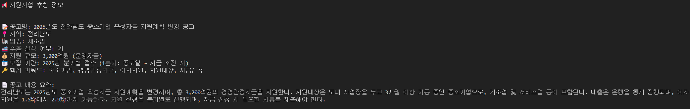

# 2025.04.22 (화)

## 1. JPG 및 HWP 파일 요약 데이터셋 제작

- JPG, PNG 등 이미지 파일 OCR 시 정확도가 60%정도이며 기존처럼 JSON 형식으로 요약 추출 가능 <br>

- 하지만 시간이 굉장히 오래 걸리며, 노트북의 사양 떄문인지 오류가 걸리고 팅기는 현상이 자주 발생하고 <br>
  이미지 파일의 갯수가 굉장히 적은 점 감안하여 <br>
  이미지 파일은 수동으로 변환하는 것이 효율적이라고 판단됩니다.

<br>

- HWP파일의 경우 PDF로 변환 후, 동일한 양식으로 데이터 추출 완료하는 과정까지 완료하였습니다. <br>

- 이 또한 코드로 진행 시 수동으로 동의해야하는 문제점이 있으나, <br>
  한글 프로그램의 버전 다운그레이드 후 보안 설정으로 해결 가능합니다. <br>
  (한글 프로그램이 유료라 당장은 진행 어려움, 현재는 크랙버전으로 최신버전 사용중)

- 그 외에도 HWP -> PDF 변환 어플이 다양하고 HWP 파일의 갯수 또한 많은 편이 아니라 큰 지장이 없다고 생각됩니다. <br>

- naver CLOVA OCR 1개월 35000원 (https://www.ncloud.com/charge/calc/ko?category=aiService#ocr)

<br>

## 2. AI 모델 선정 (OpenAI VS Gemini)

`참고 사항`

- 1글자에 약 1.5토큰 <br>
- ex) "안녕하세요" = 3~5토큰, "Hello World!" = 2토큰
- ex) 입력 500 token, 출력 300 token 사용 시,
- **0.5 _ 입력단가 + 0.3 _ 출력단가 = 요금**

<hr>
<br>

| 항목                            | GPT-4o-mini                                                                                                          | Gemini 2.0 FlashLite                                                                                                                       |
| ------------------------------- | -------------------------------------------------------------------------------------------------------------------- | ------------------------------------------------------------------------------------------------------------------------------------------ |
| 언어 이해력                     | 우수함                                                                                                               | 일상적으로는 우수                                                                                                                          |
| 대화 능력                       | 뛰어남(일관성 있음)                                                                                                  | 안정적이지만 다소 얕을 수 있음                                                                                                             |
| 반응 속도                       | 매우 빠름(real time 수준)                                                                                            | 매우 빠름(모바일 온디바이스 대응)                                                                                                          |
| 요금<br>(100만 토큰, 한화 기준) | 입력 210원, 출력 8500원<br>입력 $0.15, 출력 $6                                                                       | 입력 105원 출력 420원 <br> 입력 $0.075, 출력 $0.30                                                                                         |
| 특징                            | 실시간 Q&A, 고객지원 챗봇 등 최적화 되어 있으며, API 실 사용 사례가 많으며 Fine Tuning(커스터마이징)의 편의성이 있음 | 안드로이드 등 모바일 환경에 최적화 되어있어 가격이 낮으나 성능이 안좋으며, 사용 사례가 많이 않고 Fine Tuning(커스터마이징)의 어려움이 있음 |

<hr>
<br>

- 유저가 실제 사용하는 환경을 가정하면, <br>
  사용자의 주된 질문(입력)은 `"전라남도에서 IT 사업하고있는데 지원받을 수 있는게 있을까?"` 정도로 예상되며 <br>
  이에 따른 출력(답변)은
  `"전라남도 메타버스지원센터에서 도내 메타버스 기업의 성장 지원을 위해 시제품 제작 지원사업을 공고합니다. 지원대상은 메타버스 융합 콘텐츠 개발 비즈니스 모델을 보유한 기업이며, 선정된 과제는 과제당 1백만원 내외의 지원을 받습니다. 지원 분야는 전시 체험이 가능한 콘텐츠로, 공공데이터 활용이 필수입니다. 신청은 이메일로 가능하며, 접수 마감은 2025년 4월 29일입니다."`
  정도로 예상됩니다.

- 위의 입력과 출력의 예상 토큰 및 가격 측정 결과 <br>
  1달러 환율 1420원, 100만 토큰당 6달러(8520원) -> 1토큰당 0.00852원으로 가정<br>
  입력 예상 토큰은 약 40자, 약 60토큰 -> `0.51원`<br>
  출력 예상 토큰은 약 330자, 약 265토큰 -> `2.25원`

- 아직 제대로 데이터 추출을 하지 않았고, 모델 학습(커스터마이징) 또한 코스트가 소모되기 때문에 04.23 (내일) 데이터 정리 후 모델 학습 진행하여 실제 QA 확인 가능 할 것 같습니다.

## NAVER CLOVA OCR 결과

- 정확도 약 90%이상
- NAVER Cloud platform에서 CLOVA OCR과 API Gateway 사용 가격 1개월에 35000 + 1건당 약 3원
- 모든 데이터 잘 나타나며 기존 약 7개의 항목 모두 깔끔하게 나오는 것을 확인



## HWP를 다루는 다른 방법 탐색

- olefile - 라이브러리로 첫번째 페이지만 추출 가능
- hwp5txt - 라이브러리가 사용이 안됨(지원을 안함, 재검토 해봐야함)
- win32com - 기존에 사용했던 HWP를 PDF로 바꾸는 방식인데 자동화는 한글 버전 낮추는쪽으로 보는게 나을듯 함

<br>
<hr>

# 2025.04.23 (수)
## 1. Open AI API GPT-3.5-turbo 모델 학습 및 테스트

- GPT-4o-mini로 진행하려 하였으나 fine_tuning을 지원하지 않는 상태라 ``GPT-3.5-turbo 모델 사용``
- train 데이터 10개로 진행 결과 원하는 답을 하지 않아서 150개 데이터로 재진행
- 재학습 결과 대답은 그럴싸하게 하지만 실제론 ``없는 데이터를 그럴싸하게 지어내는 문제 발생``(hallucination 현상)
- hallucination 현상 방지를 위해 RAG 방식으로 진행

### elasticsearch docker 환경에서 설치 및 실행
- docker pull docker.elastic.co/elasticsearch/elasticsearch:8.11.3
- docker run -d --name elasticsearch -p 9200:9200 -p 9300:9300 -e "discovery.type=single-node" -e "xpack.security.enabled=false" -e "xpack.security.http.ssl.enabled=false"
 docker.elastic.co/elasticsearch/elasticsearch:8.11.3

<br>

- http://localhost:9200 으로 요청보낸 후 JSON 응답 확인, JSON으로 응답 시 성공

<br><hr>

- elasticsearch 적용 후 <br>
<br>
hallucination 현상이 해결되었으며, JSONL 파일의 실제 데이터를 잘 가져오는 것을 확인

<br>

- 가독성을 위해 formatter를 적용하여 

깔끔하게 나오도록 하였음

<br>

### 흐름 요약
```text
기존 openAI GPT 3.5 turbo 모델 fine tuning 계획을 바꿔서 RAG 방식 도입

                ▼

elasticsearch 로 JSONL 파일에서 검색

                ▼

검색된 결과를 GPT 4o mini 모델에게 전달

                ▼

GPT 4o mini 모델이 function call을 통해 정해진 형식으로 반환

                ▼

JSON 형식의 응답을 formatter를 통해 가독성 증가
```
